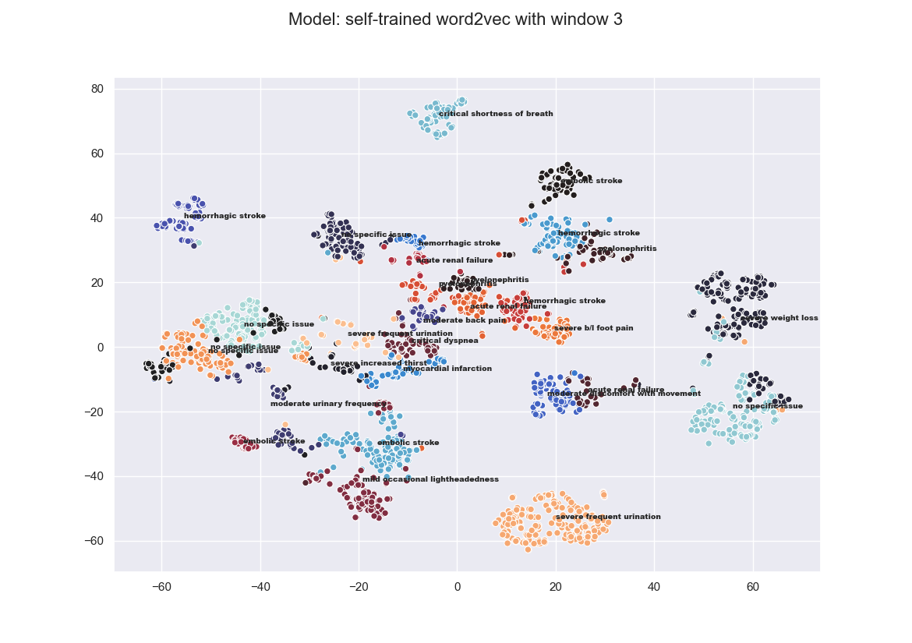
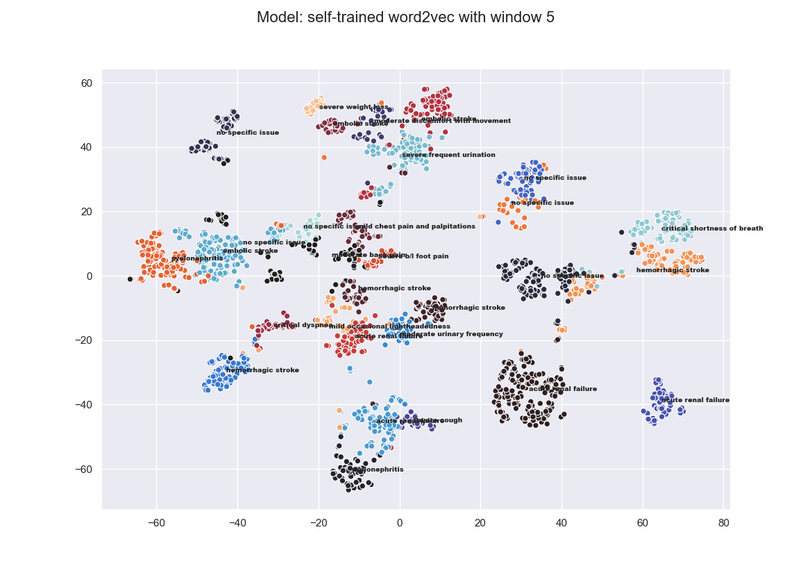
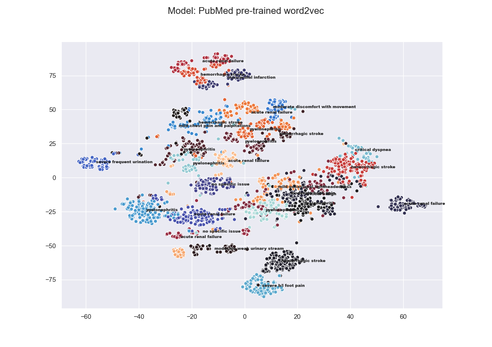
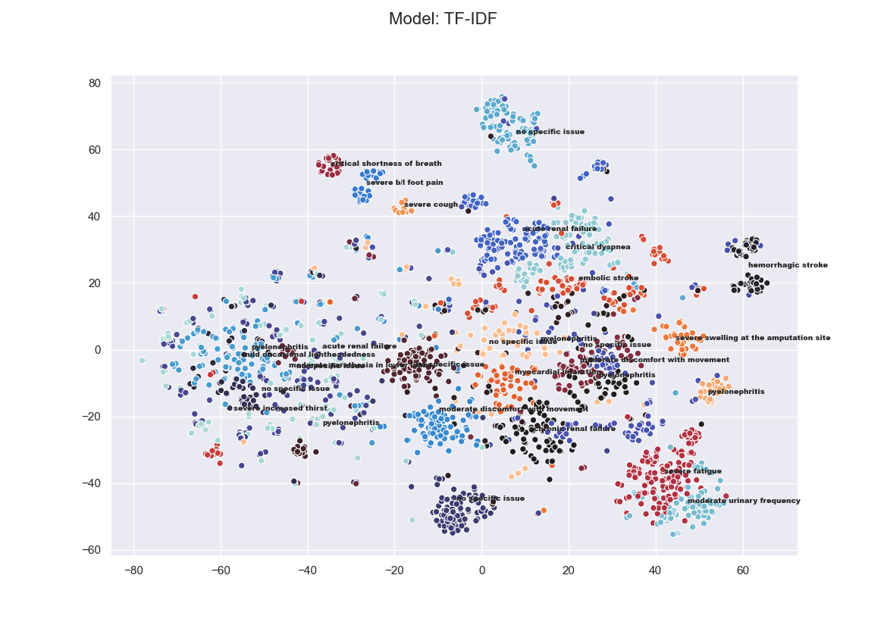
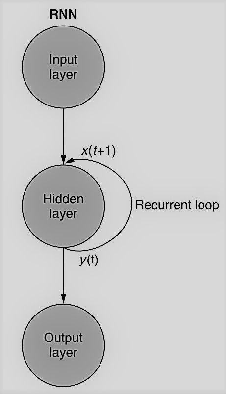
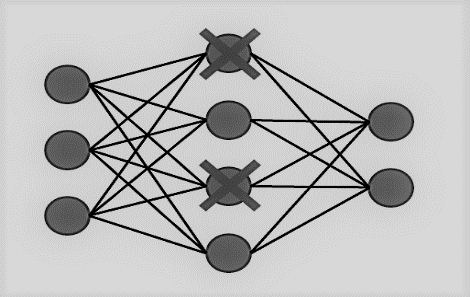
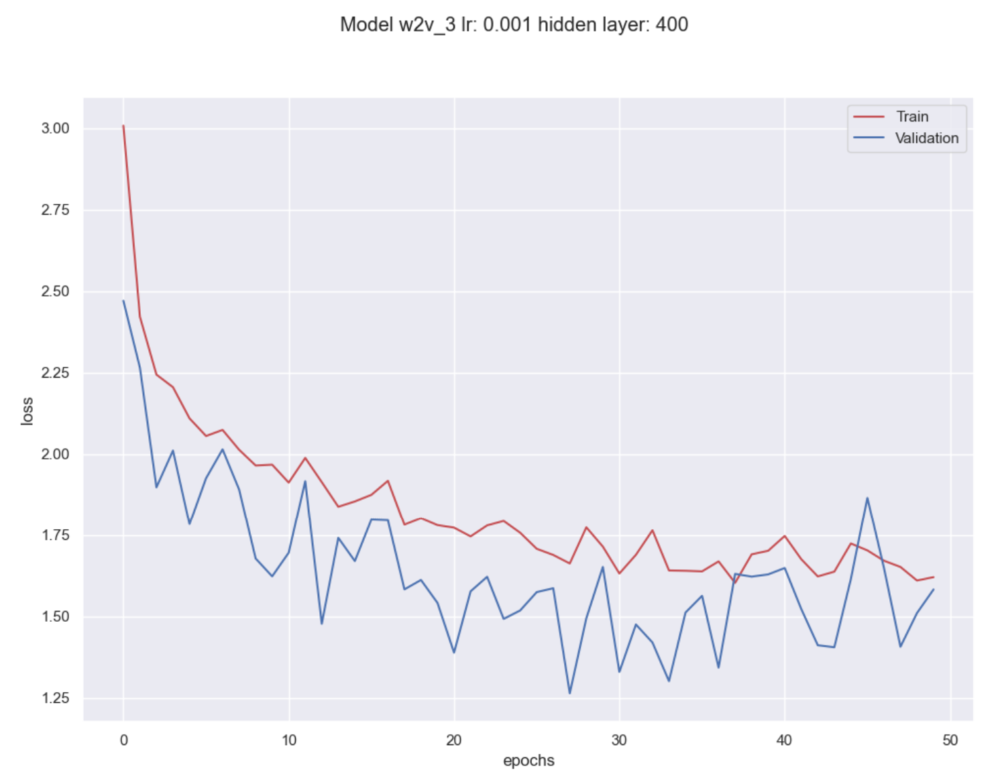
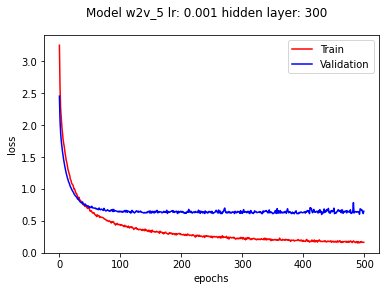

#### Multi-Class Classification of Patient&#39;s Electronic Health Records: Comparison of Supervised Models and Unsupervised Models

*Faculty of Engineering, Tel Aviv University, March, 2021*

Yonatan Jenudi, MD [linkedin](linkedin.com/in/yjenudi), Elad Gashri [linkedin](linkedin.com/in/elad-gashri-400582176)

**Abstract**

*The project compares NLP and ML models in regards to clustering and classification of electronic health records. The models included in the project are: Word2vec, TF-IDF, K-means, RNN, Random forest.*

*A database in MongoDB stores the medical text data and final clusters. A REST API in Flask returns cluster data or predicted diagnosis for new medical text.*

Ⅰ **. Introduction**

The aim of the project is to extract Chief Complaint (CC) of electronic health records and to compare the difference between two known Natural Language Processing (NLP) models in regards to analyzing medical textual data. The two NLP models are: Word2vec and TF-IDF. The data are over 3,000 SOAP notes from visits to medical professionals.

For each one of the two NLP models there are 2 tasks, in the fields of unsupervised learning and supervised learning:

1. Unsupervised learning: Cluster the texts to clusters using K-means and lower the data dimension to be able to visualize the data.

2. Supervised learning: Classify each text to the correct Chief Complaint (CC). In the Word2vec model a RNN (Recurrent Neural Network) model performs the classification and in the TF-IDF model a Random forest model does.

A database in MongoDB stores the texts and final K-means clusters for each model.

Models deployed as a REST API with multiprocessing using Flask. The API receives from a request an unknown medical text and returns details about the assigned cluster or a predicted diagnosis according to one of the models.

Modules used in the project: Python, PyTorch, Gensim, Scikit-learn, Flask, MongoDB.

Ⅱ **. Dataset**

1. SOAP notes and Chief Complaint

SOAP notes are a format for documenting the progress of a patient during a meeting or treatment. They are entered into the patient&#39;s medical records to communicate information to other providers of care. [1]

SOAP is an acronym for:

- Subjective - The patient&#39;s description of the problem.
- Objective - A physical examination and lab results descriptions.
- Assessment - A general analysis of the various components of the problem and the evaluation.
- Plan - Treatments, further checks.

An example of SOAP note:

&quot;_S: a 32 yo (years old) f (female) presents with 2 weeks history of worsening critical shortness of breath, critical cough and critical dyspnea. describes drinking an average of 12 drinks a week for about 4 years in her past. pt (patient) reports that she smokes once or twice daily. O: Height 157 cm, Weight 44.1 kg, Temperature 37.1 C, Pulse 80, SystolicBP 108, DiastolicBP 68, Respiration 15, plum: accessory muscle use, Heart = RRR, Normal S1/S2, no murmurs, HEENT: WNL, rales Bil. A :Chronic Obstructive Pulmonary Disease. P: performed E/M Level 3 (established patient) - Completed, and ordered Chest X-Ray_.&quot;

Chief Complaint (&quot;CC&quot;) - The main reason for an encounter or presenting problem.

The corresponding Chief Complaint of the above example: &quot;critical shortness of breath.&quot;

2. Data Description

To accomplish the project aims, we use an open-source dataset that contains 5,447 detailed Electronic Health Records (EHR) that describe encounters with healthcare professionals (physicians, nurses, pharmacists) and collected for over ten years. Among these EHR, we extract 3,352 &quot;SOAP&quot; notes which physicians wrote during the encounter with their corresponding Chief Complaint (&quot;CC&quot;). We decided to filter out rare CC (the threshold for dropping \&lt; 5 records per class), and therefore our final records/examples for training and testing are 3,320 with classified into 52 classes. The most common class is &#39;no specific issue&#39;. It refers to periodic physical examinations or scheduled appointments with no concrete reason.

We divide our records into three sets: train, validation, test with corresponding ratios: 0.8, 0.1, 0.1 The size of our vocabulary is 395, containing only the words from the train set.

Our dataset shows a significant imbalance between different classes. With 37% of the dataset, the most dominant class is &quot;no specific issue.&quot; With 0.18% of the dataset, the less dominant class is &quot;mild headaches particularly at the back of the head and in the morning

For fixing the imbalance, we used a method that will be explained later on.

3. Preprocessing

For our purpose, we decide to use only the S (Subjective) of the SOAP notes. The reason is that we wanted sentences that most resemble a patient-physician conversation. Preprocessing of the input records comprised the following steps:

1. Use Regular Expression to split all SOAP notes and remain with only the Subjective record.
2. Remove stop words with Natural Language Toolkit (NLTK) default English.
3. Replace standard medical terminology with the original term.
4. Stem the words with Porter Stemmer.
5. Tokenize each record into a 1-gram token.

After the preprocessing stage, each record in an array or tokens looks like the following:

[&#39;patient&#39;, &#39;complain&#39;, &#39;critic&#39;, &#39;cough&#39;, &#39;time&#39;, &#39;3&#39;, &#39;week&#39;, &#39;known&#39;, &#39;drug&#39;, &#39;allergi&#39;, &#39;patient&#39;, &#39;femal&#39;, &#39;vicar&#39;, &#39;age&#39;, &#39;54&#39;, &#39;year&#39;, &#39;drink&#39;, &#39;alcohol&#39;, &#39;occasion&#39;, &#39;deni&#39;, &#39;ever&#39;, &#39;use&#39;, &#39;cigarett&#39;].

After tokenization, the longest sentence contains 42 tokens and the average size is of a sentence is 18.5.

Ⅲ **. Embedding Models**

To train our records, we examine two embedding models:

1. TF-IDF

TF-IDF  (term frequency-inverse document frequency) is a numerical method that is intended to reflect how important a word is to a document in a collection of documents. TF-IDF is calculated by the multiplication of 2 values:

**Term frequency** -measure how frequent a word is in a specific text

_tf(t,d) = (# times of t in d / # of words in d)_

**Inverse document frequency** - measure how rare a word is in the collection of texts. The rarer the word, the higher the score.

_idf(t) = log(# of d / # of d with t in it)_

We used this method as an embedding model to represent the texts in our data. The embedded records are averaged into a fixed-size vector of a dimension of 395 (padded with zeros).

For each text, the result was a 395 dimensional vector. 395 was the amount of words in our data.  Each value in the 300 dimensional vector represents the TF-IDF value for the specific word in that text. If that specific word doesn&#39;t appear in the text, it received the value 0 (meaning the vector was padded with zeros).

We used Scikit-learn&#39;s tfidf-vectorizer in order to implement TF-IDF for our data.

2. Word2Vec

Word vectors are numerical vector representations of word semantics or meaning, including literal and implied meaning. So word vectors can capture the connotation of words, and they combine all that into a dense vector (no zeros) of floating-point values. This dense vector enables queries and logical reasoning. The Word2vec model contains information about the relationships between words, including similarity. [2]

There are two possible ways to train Word2vec embeddings:

1. The skip-gram approach predicts the context of words (output words) from a word of interest (the input word).
2. The continuous bag-of-words (CBOW) approach predicts the target word (the output word) from the nearby words (input words).

We compared three different Word2vec-CBOW methods for word representation:

1. Self-trained with window = 5, vector dimensions (to represent the word vector) = 300, min word count = 0.
2. Self-trained with window = 3, vector dimensions = 300, min word count = 0.
3. The medical PubMed Word2Vec pre-trained model: The model was trained over 2.4 terms with a dimension of 200 as an output vector[5].

We use the gensim.word2vec module for training our models. Stop words carry meaning to the words surrounding them. Therefore, we do not drop the stop words in our preprocessing step before training our words vectors. Our self-trained word2vec models were trained for 30 epochs. The advantage of using our self-trained models is that we train our unique corpus. The disadvantage is the size of our vocabulary - 395 word , much smaller compared to the PubMed Word2Vec model.

Ⅳ**. Models Comparison in Unsupervised Learning (Clustering)**

*K-means*

The objective of clustering is to identify distinct groups in a dataset such that the observations within a group are similar to each other but different from observations in other groups. In k-means clustering, we specify the number of desired clusters k, and the algorithm will assign each observation to exactly one of these k clusters. The algorithm optimizes the groups by minimizing the within-cluster variation (also known as inertia) such that the sum of the within cluster variations across all k clusters is as small as possible.

Different runs of k-means will result in slightly different cluster assignments because k-means randomly assigns each observation to one of the k clusters to kick off the clustering process. k-means does this random initialization to speed up the clustering process. After this random initialization, k-means reassigns the observations to different clusters as it attempts to minimize the Euclidean distance between each observation and its cluster&#39;s center point, or centroid.

Typically, the k-means algorithm does several runs and chooses the run that has the best separation, defined as the lowest total sum of within-cluster variations across all k clusters. [3]

*t-distributed Stochastic Neighbor Embedding (t-SNE)*

t-SNE is a tool to visualize high-dimensional data. It converts similarities between data points to joint probabilities and tries to minimize the Kullback-Leibler divergence between the joint probabilities of the low-dimensional embedding and the high-dimensional data. t-SNE has a cost function that is not convex, i.e. with different initializations we can get different results. [4]

1. Word2Vec compared to TF-ID

We want to distinguish some NLP model&#39;s performance. Hence, our first step was to cluster them, see any clinical and semantic associations between various records, and choose only the best for our next step - supervised learning. Our criteria for measuring these models are whether physician-patient conversations represented by the chief complaints and clustered together are similar.

The Word2vec and TF-IDF embeddings were used for clustering using a K-means algorithm and t-SNE (sklearn modules) to compare the models (for each model):

1. Randomly initialize k (=30) means.
2. Assign each vector with the nearest representative mean using Euclidean distance.
3. For each group of vectors that were assigned together, compute the new mean.
4. Repeat steps 2 and 3, until there is not any change with the assigned vectors.
5. Lower the dimensionality of the vectors into 2 with t-SNE.

The results are presented in the following figures:

1. **K-means clustering of the word2vec window=3, vector size=300**

In the first model (st-w2v3), we can see some interesting findings. The clustered clusters in the upper right are embolic stroke, hemorrhagic stroke, and pyelonephritis. The similarity between embolic and hemorrhagic stroke is well understood. However, we won&#39;t expect any association with pyelonephritis symptoms. Moreover, we can see other clusters of hemorrhagic stroke records appearing on the upper left side of the figure.

In the middle-left of the figure, we notice some clusters with substantial clinical and semantic similarity. The clusters severe frequent urination, severe increased thirst, and moderate frequent urination are symptoms of diabetes. Hence the model performed well for clustering them close to each other.

In the middle-right, we also view the clusters&#39; apparent clinical association since myocardial infraction can be presented as moderate back pain and critical dyspnea.

The last clusters to be noticed in this model are middle-down on the figure, where mild lightheadedness can also be a symptom of embolic stroke.

2. **K-means clustering of the word2vec window=5, vector size=300**

In the following model (st-w2v5), we can observe that each cluster is more unified in its centroids than the st-w2v3 model. Regarding the clinical similarities between different clusters, in the upper-middle, we observe some clusters, embolic stroke, severe weight loss, and moderate discomfort with movement, which do not share common clinical symptoms.

There is no clinical symptoms association between the clusters&#39; critical shortness of breath and hemorrhagic stroke in the figure&#39;s middle-right side.

In the middle of the figure, we notice the clusters of hemorrhagic stroke and bilateral foot pain, which we find similar since strokes can also be represented as walking difficulties.

Furthermore, in the middle-down, we again see the clusters that are matched together with some clinical sense, mild lightheadedness, and stroke.

3. **K-means clustering of the PubMed word2vec, vector size=200**

The third figure represents the PubMed model. In general, we observe a more spread-like shape of the clusters than the st-w2v5 model and many clusters CCs regarding the Nephro-Urology domain.

We can see some clinical similarities of pyelonephritis and acute renal failure in the figures middle-left and middle-down. As we detected in the st-w2v5 model, the model cluster together severe bilateral foot pain and stroke. The clusters of hemorrhagic stroke and mild lightheadedness also centered together.

4. **K-means clustering of the TF-IDF, vector size=300**

The last figure represents the TF-IDF model. The model looks purely clustered as its spread all over the figure, and clusters are mixed. On the upper-left side, we observe severe cough and shortness of breath clusters with clinical similarity and can be associated with asthma or upper respiratory infection symptoms. But there is no clinical association to foot pain.

The figure&#39;s middle-left clusters have mixed some CCs that have and do not have a clinical association.

The model well clusters the amputations records in the middle-left and the diabetes symptoms CC in the right-down.

2. Conclusions of the k-means clustering

After reviewing the models k-means clustering, it seems that st-w2v3 performs well for clustering together CCs with clinical similarities. st-w2v5 performs well in centering each cluster to its centroid, and the TF-IDF model also has a good result in clustering CCs with the clinical association. Hence, we decided to compare the following models with supervised learning: st-w2v3, st-w2v5, and TF-IDF, and to drop the PubMed model.

Ⅴ**.  Models Comparison in Supervised Learning (Classification)**

1. Word2vec &amp; RNN

The first model that we use for training our models is Recurrent Neural Network (RNN). The advantage of RNN is that it &quot;remembers&quot; every output of a token. The basic idea of RNN represented in the following figure [2]:

_t_ is the token sequence(record) index. _t=0_ is the first token, _t+1_ the next token, and so on. For each token step, we generate output that gets fed into the network again. That&#39;s how RNN is &quot;remembering&quot; the previous outputs, and with these outputs, we generate a new output until all the sequence is fed.

We build a simple RNN architecture with Pytorch module:
1.	As mentioned, the longest sentence contains 42 tokens, hence, we padded with a vector of zeros (length 300) sentences to reach the max tokens length, so we stack them together as a batches.
2.	For each of our word2vec models, we construct a tensor of size [batch size = 10, max sequence length=42, embedding vector length = 300]
3.	Each tensor is composed of "mini" tensors that get into the net one by one. For each, we add the previous output (except the first tensor, that we add a zero-vector of the same size)
4.	We use a hidden layer of size 300 (hyper-parameter)
5.	After we finish a sequence, we compute the loss with the final output and back-propagate to update the net's weights matrices. 

We have a multi-class imbalanced dataset so we use Cross-Entropy loss function, and pass into the function the classes weight to compute our losses.

loss(_x_,_class_) = _weight_[_class_] (−_x_[_class_]+log(∑exp(_x_[_j_])))

Our models have 1,016,452 trainable parameters, two RNN layers, and we use Stochastic gradient descent (SGD) algorithm to update the parameters based on the computed gradients. We pass to the optimizer algorithm a weight decay (L2 penalty = 0.01) to avoid overfitting.

To further control the complexity of our model and avoid overfitting, we use a one dropout layer with a probability of 0.9, as shown in the following figure, the dropout layer purpose is to balance the network so that every node works equally toward the same goal, and if one makes a mistake, it won’t dominate the behavior of the model.

For each of our two word2vec representations we trained our RNN for 500 epochs with learning rate of 0.001 on the training set and fine-tuned hyper-parameters according the performance on the validation set.
Summary of hyper-parameters:
•	hidden vector size length: 300
•	number of RNN layers: 2
•	learning rate: 0.001
•	one dropout layer with probability: 0.9
•	L2 penalty: 0.01
•	embedding vector length: 300
•	embedding window: 3 or 5
•	max sequence length: 42
•	batch size: 10
•	epochs: 500

1. RNN with self-trained word2vec with window 3:

1. RNN with self-trained word2vec with window 5:

Models loss interpretation after training

According to these figures, we observe that our models did improve in each epoch. Both of our models slightly over-fit. We kept training our models until there was not a significant improvement in the validation loss so we could maximize our scores.  
We can see that after 80 epochs, the model's validation curves got into a plateau regarding their learning capabilities.
The models seem to perform pretty much the same. Although the first model (st-w2v3) is slightly better, we can observe that its learning curve is more likely to converge. 

1. TF-IDF &amp; Random Forest

The TF-IDF embeddings were used for classification using a Random forest model. The texts were being classified to their CCs according to the dataset.

Random forest is a model which is an ensemble method- it is made up of many decision trees. A Decision Tree is a predictor that predicts the label associated with an instance by traveling from a root node of a tree to a leaf.

The Random forest model uses bootstrap - random sampling from data when building decision trees, and random sampling of features when splitting trees nodes.

The validation set was used in order to evaluate the best value for the hyper-parameter &quot;number of estimators.&quot; This hyper-parameter is the number of decision trees the Random Forest model is composed of. The best number of estimators

was 1,000, with a score of 80.1% on the validation set. This value was chosen for classification and comparison with the RNN model.

The criterion chosen for splitting the trees was &quot;The Gini index,&quot; with no max depth limitation on the trees.

We used Scikit-learn&#39;s RandomForestClassifierin order to implement the Random forest model for our data.

1. Models scores comparison and analysis

The final micro f1 scores that were calculated over the test set are presented in the following table:

| **Model** | **Micro-F Score** |
| --- | --- |
| RNN-CBOW  self-trained word2vec with w= 3 | 82.72% |
| RNN-CBOW  self-trained word2vec with w= 5 | 81.65% |
| Random Forest TF-IDF | 74.02% |

We can observe that RNN-CBOW st-w2v3 has the best performance with 82.72% over the test set.
We also observe that window = 3 of the self-trained word2vec3 model is over-performed over window =5 of the self-trained word2ve5 model.

The main issue that we faced during the training is a significant imbalance of data. Since the proportion of one of the classes is almost 38% of all data ("no specific issue"), there are classes present in the data in less than 1%. We tried to avoid the classes imbalance and overfitting by passing the weights of the classes to the loss function, L2 regularization and a dropout layer.

As we trained our models using RNN, we faced a tradeoff. When we increased the net complexity to learn and converge more quickly, the models over-fitted. But when we decreased the model complexity, we had to give the models more epochs to learn, then the model was exposed more frequently to the most dominant class and under-fitted over the rare classes.

Ⅵ **.**  **Server Side Development**

1. Database

A database was developed in MongoDB. It was decided that the scheme of the database would contain 3 collections:

1. Sentences- the details about every medical text (&quot;sentence&quot;) were saved in a document. Each document contains: the original text (before the preprocessing), diagnosis (&quot;label&quot;), TF-IDF embeddings and Word2vec embeddings.
2. TF-IDF clusters- the details about every cluster according to the TF-IDF model were saved in a document. Every document contains: sentences in cluster (references to the sentences collection), cluster centroid and the most common labels in the cluster.
3. Word2vec clusters- same as the TF-IDF collection.

1. REST API

The REST API was developed with the Flask framework and the multiprocessing module. The API works in parallel and can process few requests at the same time. For every new request, the API creates a new process, in condition, the amount of the currently running processes didn&#39;t surpass a predetermined threshold (the number of CPUs in the computer). The created process handles the request and sends the original process&#39;s response using a queue, a data structure for inter-process communication similar to the UNIX pipeline.

The API receives a POST request with a new medical text. There are 4 API endpoints:

1. tfidf\_random\_forest\_classification - Predicted diagnosis for the condition described in the text according to the TF-IDF &amp; Random forest model.
2. word2vec\_rnn\_classification - Predicted diagnosis for the condition described in the text according to the Word2vec &amp; RNN model.
3. tfidf\_cluster - Most common labels and closest sentences in the cluster assigned to the text according to the Word2vec &amp; K-means model or the TF-IDF &amp; K-means model.
4. word2vec\_cluster - Most common labels and closest sentences in the cluster assigned to the text according to the Word2vec &amp; K-means model.

**VII.**  **Summary and conclusions**

Our main aim was to extract the chief complaint of electronic health records and compare different NLP models in this project. We review various models, algorithms, and techniques, some are supervised, and some are unsupervised methods. Our data contains SOAP notes and Chief Complaints about every note. We decided to use only the subjective part of SOAP notes because they resemble a physician-patient conversation.

The first part preprocessed these SOAP notes and transformed them into a well-suited structure for the project's later steps. 

The second part was to convert our tokens into embeddings form (vector representation of the word). Hence we compared two different approaches. TF-IDF and word2vec. The latter method was also evaluated using other models to convert our tokens into embeddings. 
The third part was to initialize an unsupervised model to try to eliminate some of our models. We used K-means for clustering, t-SNE for dimension reduction and viewed how well the models get clustered. 

After eliminating the PubMed pre-trained model, in the fourth part, we used an RNN-CBOW for classifying the word2vec models and Random forest algorithm for the TF-IDF model. The results showed that our project's best model to represent, classify, and extract the chief complaint from our data was RNN-CBOW self-trained word2vec of window size 3. 

We conclude our project with a suggestion to further investigate this project's aim by using 2 or 3 n-grams, using long short-term memory (LSTM) or Gated recurrent unit (GRU), using a pre-trained RNN network (transfer learning), or use of sentences augmentation.

**VIII.**  **References**

1. [_https://www.physio-pedia.com/SOAP\_Notes_](https://www.physio-pedia.com/SOAP_Notes)
2. _Hobson Lane, Hannes Hapke, Cole Howard - Natural Language Processing in Action - Understanding, analyzing, and generating text with Python_
3. _Ankur A. Patel - Hands-On Unsupervised Learning Using Python How to Build Applied Machine Learning Solutions from Unlabeled Data_
4. [_https://scikit-learn.org/stable/modules/generated/sklearn.manifold.TSNE.html_](https://scikit-learn.org/stable/modules/generated/sklearn.manifold.TSNE.html)
5. _Faiza Khan Khattak, Serena Jeblee, ChloéPouProm, Mohamed Abdalla, Christopher Meaney, FrankRudzicz - A survey of word embeddings for clinical text_
